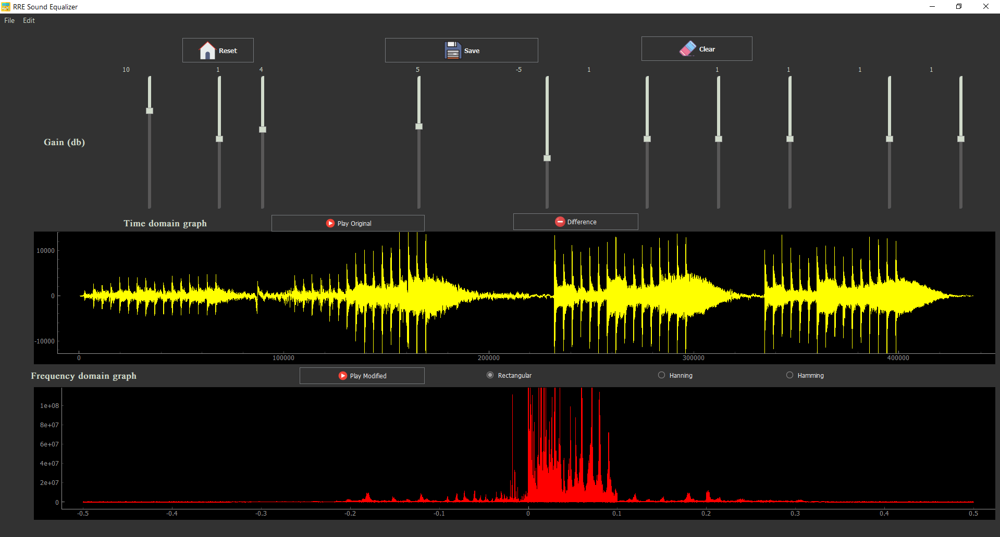

# Music-Equalizer

### please install all the dependencies from [dep.txt](dep.txt) file 
## Description
**Music Equalizer with media player and visualizer:**
* Adjust 10 equalizer bands gains(up to 22KHz) . 
* The ability to choose the type of window ( Rectangular, Hamming or Hanning window)
* Play the sound before and after modification
* Display the Fourier transform of the adjusted input file
* Display the fourier and time domain plots of the difference between the modified and original file
* Save the modified file  as .wav.

